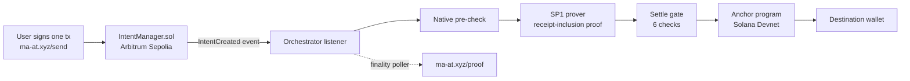

# Maat

> Cross-chain solvers are unsecured credit facilities operating without underwriting. Maat is built to treat them like it.

Maat is a cross-chain intent protocol. A user signs one transaction on the source chain. An SP1 zero-knowledge proof establishes that the intent event is included in a specific source-chain block, and the exact amount is settled to the destination wallet. No bridges, no wrapped tokens, no destination gas for the user.

**Status:** testnet MVP, built solo. This README describes what runs today and labels everything else as roadmap.

---

## What works today (testnet)

- **Route:** Arbitrum Sepolia → Solana Devnet, native ETH as the source asset.
- **ZK proof of event inclusion (SP1):** the program hashes the Arbitrum block header, verifies a Merkle-Patricia proof of the transaction receipt against the header's `receiptsRoot`, checks the log was emitted by `IntentManager` with the `IntentCreated` topic, and decodes every intent field from that log. Receipt status must be success and expiry must be after the block timestamp.
  - 107,832 zkVM cycles per proof.
  - ~7 minutes and ~14 GB RAM per proof on the SP1 CPU prover (4-vCPU VPS).
  - Tampering tests: altered amount, wrong contract, a real log from a different contract with the same event signature, altered header, and altered receipt all fail.
- **Settlement gate (orchestrator):** a payout is sent only if all six checks pass: emitting contract is the deployed `IntentManager`; the proven block hash matches the canonical hash at that height (fresh RPC call); verification key matches; intent not already settled; destination chain is Solana; intent not expired.
- **Crash-safe settlement ledger:** the Solana signature is recorded before broadcast; on restart, in-flight settlements are checked by signature, never blindly re-sent.
- **Live dashboard:** [ma-at.xyz/proof](https://ma-at.xyz/proof) shows each intent's proof status, block, settlement signature, and finality.

## Trust model today

| Component | Today | Roadmap |
| --- | --- | --- |
| Intent event included in a source block | **ZK** (SP1 receipt-inclusion proof) | — |
| That block is canonical Arbitrum | Checked by the orchestrator against RPC | Self-hosted, self-validating nodes; ZK light client |
| L1 finality of that block | Arbitrum `finalized` tag via RPC, shown on the dashboard (not ZK) | ZK finality (e.g. SP1-Helios + Arbitrum batch proof) |
| Settlement on Solana | Sent by the orchestrator after the off-chain settle gate; the Solana program does not verify the proof yet | On-chain Groth16 verification on Solana |
| Double-settle protection | Orchestrator ledger | On-chain replay protection in the Solana program |
| Solver credit scoring | Designed, not yet implemented | Next milestone |

## Known limitations

- Proofs run one at a time, ~7 minutes each (roughly 8 intents per hour).
- Native ETH only as the source asset. ERC-20 intents are accepted by the contract but not routed.
- Solana is the only destination.
- TRON Nile and Robinhood Chain Testnet contracts are deployed, but their intents are not proven or settled yet (shown as "coming soon").
- One intent per transaction.

---

## Architecture (current)



## Repository structure

```
/contracts/evm     → IntentManager.sol (Foundry)
/contracts/solana  → Anchor settlement program
/orchestrator      → Listeners, prover pipeline, settle gate, settlement
/zk                → SP1 program (receipt inclusion) + host prover
```

The frontend (ma-at.xyz) lives in a separate repository: <!-- ADD LINK -->

---

## Smart contracts

### Solana Anchor settlement program (Anchor 0.31.0, Devnet)

| Instruction | Description |
| --- | --- |
| `initialize` | Sets admin + orchestrator on ProgramState |
| `submit_intent` | Escrows lamports, stores intent on-chain |
| `receive_settlement` | Called by the orchestrator after the off-chain settle gate passes. Enforces slippage and refunds any excess. Records the proof hash; does not verify the proof on-chain. |
| `cancel_intent` | Owner reclaims escrowed lamports after expiry, or at any time while the program is paused |
| `set_circuit_breaker` | Admin halts/unhalts channels by channel ID |
| `pause` / `unpause` | Emergency admin controls |

### EVM IntentManager (Solidity, Arbitrum Sepolia + Robinhood Chain Testnet)

| Function | Description |
| --- | --- |
| `submitIntent` | Escrows ETH or an ERC-20, creates the intent, emits `IntentCreated`, enforces circuit breaker |
| `postCollateral` | Solver posts 150% collateral against the intent amount |
| `confirmSettlement` | Orchestrator releases escrow to the solver after off-chain proof verification (no on-chain verification) |
| `slashSolver` | Orchestrator slashes a failed solver: escrow returns to the user, the solver's collateral goes to the treasury |
| `cancelIntent` | Intent owner reclaims escrow once the intent has expired, if no solver posted collateral |

`IntentCreated(bytes32 indexed intentId, address indexed sender, uint256 amount, address tokenAddress, bytes32 destinationWallet, uint64 destinationChainId, uint64 expiry, uint16 slippageBps)`

`destinationWallet` is `bytes32`: raw 32-byte pubkey for Solana, left-padded for EVM, base58check-decoded and padded for TRON. Solana's destination chain ID is `1399811149`.

## Deployed contracts

| Network | Address | Explorer |
| --- | --- | --- |
| Arbitrum Sepolia | `0x9D1bd7119E9FefF6Baa3968272811323B354B16f` | [Arbiscan](https://sepolia.arbiscan.io/address/0x9D1bd7119E9FefF6Baa3968272811323B354B16f) |
| Robinhood Chain Testnet | `0xcA6bf2D574209D49515a9Eeb61E27924edE28860` | [Explorer](https://explorer.testnet.chain.robinhood.com/address/0xcA6bf2D574209D49515a9Eeb61E27924edE28860) |
| TRON Nile Testnet | `TW1PqkjksxFUefywyYYNHS4P2jeQaXzJWe` | [Tronscan](https://nile.tronscan.org/#/contract/TW1PqkjksxFUefywyYYNHS4P2jeQaXzJWe) |
| Solana Devnet (program) | `9nKpoMMP2ZX2bRudcXjpAS4VtSJBxiZ8wsM69LAkHikv` | |

Current SP1 verification key: `0x000c653a242999b53decd2c3d31fc211e432b38eb4ead432b789607eb8621937`

---

## Security

- **Implemented:** the ZK receipt-inclusion proof, the six-check settle gate, the crash-safe settlement ledger, pausable contracts, and circuit breakers.
- **Internal automated review:** contracts were checked with [glassofbeer.ai/heist](https://glassofbeer.ai/heist), our own adversarial exploit agent. This is an in-house tool, not a third-party audit. <!-- VERIFY: was it re-run on the current IntentManager (bytes32 / tokenAddress version)? State the date or commit. -->
- **Planned before mainnet:** an external third-party audit.

## The risk framework

Maat applies credit-risk principles to solver infrastructure. These are design goals, not yet implemented:

- Solvers are treated as unsecured credit facilities and must be underwritten.
- Collateral requirements scale with intent size.
- High-value intents route only to top-tier solvers.
- A solver fronting funds before L1 finality is extending credit; its tier sets that credit limit.

## Roadmap

- Solver credit scoring and tiered routing.
- On-chain proof verification on Solana (Groth16) and on-chain replay protection.
- ZK proof of L1 finality.
- Proving on dedicated hardware or a prover network, to remove the one-at-a-time limit.
- Agent-to-agent (A2A) intent endpoint.
- Orchestration chain (Cosmos SDK) and a distributed node network.

---

## Links

- Website: [ma-at.xyz](https://ma-at.xyz)
- Proof dashboard: [ma-at.xyz/proof](https://ma-at.xyz/proof)
- X: [@0xfourier](https://x.com/0xfourier)

*Maat | Solo founder build* 
