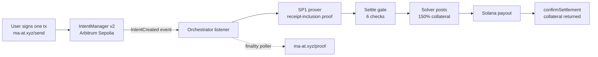

# Maat

> Cross-chain solvers are unsecured credit facilities operating without underwriting. Maat is built to treat them like it.

Maat is a cross-chain intent protocol. A user signs one transaction on the source chain. An SP1 zero-knowledge proof establishes that the intent event is included in a specific source-chain block, and the exact amount is settled to the destination wallet. No bridges, no wrapped tokens, no destination gas for the user.

**Status:** testnet MVP, built solo. This README describes what runs today and labels everything else as roadmap.

---

## What works today (testnet)

- **Route:** Arbitrum Sepolia → Solana Devnet, native ETH as the source asset.
- **ZK proof of event inclusion (SP1):** the program hashes the Arbitrum block header, verifies a Merkle-Patricia proof of the transaction receipt against the header's `receiptsRoot`, checks the log was emitted by `IntentManager` with the `IntentCreated` topic, and decodes every intent field from that log. Receipt status must be success and expiry must be after the block timestamp.
  - 107,832 zkVM cycles per proof.
  - ~7 minutes and ~14 GB RAM per proof on the SP1 CPU prover (4-vCPU VPS).
  - Tampering tests: altered amount, wrong contract, a real log from a different contract with the same event signature, altered header, and altered receipt all fail.
- **Solver collateral (v2):** an approved solver posts 150% collateral before a payout, and gets it back in full on successful settlement. A solver that fails to deliver before expiry is slashed: the user's escrow is refunded and the solver's collateral is forfeited.
- **Settlement gate (orchestrator):** a payout is sent only if all six checks pass: emitting contract is the deployed `IntentManager`; the proven block hash matches the canonical hash at that height (fresh RPC call); verification key matches; intent not already settled; destination chain is Solana; intent not expired.
- **Crash-safe settlement ledger:** the Solana signature is recorded before broadcast; on restart, in-flight settlements are checked by signature, never blindly re-sent. The Arbitrum-side sequence (collateral → payout → confirm) is independently reconciled the same way.
- **Live dashboard:** [ma-at.xyz/proof](https://ma-at.xyz/proof) shows each intent's proof status, block, settlement signature, and finality.

## Trust model today

| Component | Today | Roadmap |
| --- | --- | --- |
| Intent event included in a source block | **ZK** (SP1 receipt-inclusion proof) | — |
| That block is canonical Arbitrum | Checked by the orchestrator against RPC | Self-hosted, self-validating nodes; ZK light client |
| L1 finality of that block | Arbitrum `finalized` tag via RPC, shown on the dashboard (not ZK) | ZK finality (e.g. SP1-Helios + Arbitrum batch proof) |
| Settlement on Solana | Sent by the orchestrator after the off-chain settle gate; the Solana program does not verify the proof yet | On-chain Groth16 verification on Solana |
| Double-settle protection | On-chain status latch on Arbitrum (each intent is a one-way `Pending → {Settled\|Slashed\|Refunded\|Expired}` transition, independently audited); orchestrator ledger on the Solana leg | On-chain replay protection on the Solana program too |
| Solver credit scoring | Designed, not yet implemented | Next milestone |

## Known limitations

- Proofs run one at a time, ~7 minutes each (roughly 8 intents per hour).
- Native ETH only as the source asset. ERC-20 intents are accepted by the contract but not routed.
- Solver collateral is always ETH, and for ERC-20 intents the 150% ratio is applied to the raw token amount without any price or decimals valuation (Finding C in the v2 review, not fixed). ERC-20 intents should not be used with real funds until this is addressed.
- Solana is the only destination.
- TRON Nile and Robinhood Chain Testnet contracts are deployed, but their intents are not proven or settled yet (shown as "coming soon").
- One intent per transaction.
- The orchestrator does not replay missed events. An intent submitted while it is down is never proven or settled; its funds can only be reclaimed by the owner (`cancelIntent` after expiry, or `claimRefund` 24 hours after expiry if a solver posted collateral).
- **Solana program (Devnet): build provenance, not verified as reproducible.** The program at `9nKpoMMP2ZX2bRudcXjpAS4VtSJBxiZ8wsM69LAkHikv` was built with `anchor build` (solana-cli 2.1.0, platform-tools v1.43, Anchor 0.31.0) in a local checkout of commit `db17e8a` and deployed with `anchor deploy` on 2026-09-21. Its sha256 as stored on-chain is `63bee0b4c3efc51bc07875869b142da9aaec9c475c0d0c2b9d34fb9dd1130c66` (executable hash `05c7928a94091a4fb001e76b0ab785706daea297b04ebd5b2529f69113252fcb`). It is **not verified as a reproducible build**: three local rebuilds of the same commit with the same toolchain each produced a different binary (the two compared section by section had identical size, dynamic symbols and relocations, but different `.text` and `.rodata`), so a byte-for-byte match with the chain could not be established, and no `solana-verify` attestation exists. A deterministic Docker-based build and attestation are planned after the hackathon submission.

## Architecture (current)


```mermaid
flowchart LR
  U["User signs one tx<br/>ma-at.xyz/send"] --> C["IntentManager v2<br/>Arbitrum Sepolia"]
  C -- "IntentCreated event" --> L["Orchestrator listener"]
  L --> Z["SP1 prover<br/>receipt-inclusion proof"]
  Z --> G["Settle gate<br/>6 checks"]
  G --> PC["Solver posts<br/>150% collateral"]
  PC --> S["Solana payout"]
  S --> CS["confirmSettlement<br/>collateral returned"]
  L -. "finality poller" .-> D["ma-at.xyz/proof"]
```

## Repository structure

```
/contracts/evm     → IntentManager.sol (Foundry)
/contracts/solana  → Anchor settlement program
/orchestrator      → Listeners, prover pipeline, settle gate, settlement
/zk                → SP1 program (receipt inclusion) + host prover
/docs/audits       → Independent security review reports
```

The frontend (ma-at.xyz) lives in a separate repository.

---

## Smart contracts

### Solana Anchor settlement program (Anchor 0.31.0, Devnet)

| Instruction | Description |
| --- | --- |
| `initialize` | Sets admin + orchestrator on ProgramState |
| `submit_intent` | Escrows lamports, stores intent on-chain |
| `receive_settlement` | Called by the orchestrator after the off-chain settle gate passes. Enforces slippage and refunds any excess. Records the proof hash; does not verify the proof on-chain. |
| `cancel_intent` | Owner reclaims escrowed lamports after expiry, or at any time while the program is paused |
| `set_circuit_breaker` | Admin halts/unhalts channels by channel ID |
| `pause` / `unpause` | Emergency admin controls |

### EVM IntentManager (Solidity, Arbitrum Sepolia + Robinhood Chain Testnet)

| Function | Description |
| --- | --- |
| `submitIntent` | Escrows ETH or an ERC-20, creates the intent, emits `IntentCreated`, enforces circuit breaker |
| `postCollateral` | An owner-approved solver posts 150% collateral against the intent amount |
| `confirmSettlement` | Orchestrator releases escrow to the solver after off-chain proof verification (no on-chain verification), and returns the solver's collateral in full |
| `slashSolver` | Orchestrator slashes a failed solver: escrow returns to the user, the solver's collateral goes to the treasury |
| `cancelIntent` | Intent owner reclaims escrow once the intent has expired, if no solver posted collateral |
| `claimRefund` | Escape hatch: if a solver posted collateral but the orchestrator never confirms or slashes, the intent owner can reclaim escrow 24 hours after expiry — even while the contract is paused |

`IntentCreated(bytes32 indexed intentId, address indexed sender, uint256 amount, address tokenAddress, bytes32 destinationWallet, uint64 destinationChainId, uint64 expiry, uint16 slippageBps)`

`destinationWallet` is `bytes32`: raw 32-byte pubkey for Solana, left-padded for EVM, base58check-decoded and padded for TRON. Solana's destination chain ID is `1399811149`.

## Build and test

The EVM contracts (`contracts/evm`) use [Foundry](https://getfoundry.sh). OpenZeppelin Contracts and forge-std are git submodules, pinned to OpenZeppelin Contracts at `9a02119` and forge-std at `7239323` — both untagged upstream master commits that reproduce the exact sources the deployed IntentManager was built with.

```bash
git clone --recurse-submodules https://github.com/NthMOMENT/ma-at.git
cd ma-at/contracts/evm
forge test
```

If you cloned without `--recurse-submodules`, fetch the dependencies first (from the repository root):

```bash
git submodule update --init --recursive
```

`forge test` runs 45 tests (45 passing), including tests for fee-on-transfer escrow accounting, `withdrawTreasury`, and a treasury that cannot receive ETH.

## Deployed contracts

| Network | Address | Explorer |
| --- | --- | --- |
| Arbitrum Sepolia (v3) | `0x19a315C0f6369f419073F9c13A3755221A4BceD6` | [Arbiscan](https://sepolia.arbiscan.io/address/0x19a315C0f6369f419073F9c13A3755221A4BceD6) |
| Robinhood Chain Testnet | `0xcA6bf2D574209D49515a9Eeb61E27924edE28860` | [Explorer](https://explorer.testnet.chain.robinhood.com/address/0xcA6bf2D574209D49515a9Eeb61E27924edE28860) |
| TRON Nile Testnet | `TW1PqkjksxFUefywyYYNHS4P2jeQaXzJWe` | [Tronscan](https://nile.tronscan.org/#/contract/TW1PqkjksxFUefywyYYNHS4P2jeQaXzJWe) |
| Solana Devnet (program) | `9nKpoMMP2ZX2bRudcXjpAS4VtSJBxiZ8wsM69LAkHikv` | |

Current SP1 verification key: `0x000c653a242999b53decd2c3d31fc211e432b38eb4ead432b789607eb8621937`

## Agent interface (A2A-style, testnet)

A2A-style JSON-RPC interface; not full A2A spec conformance. Testnet only (Arbitrum Sepolia). Agent card: `https://ma-at.xyz/.well-known/agent-card.json`; endpoint: `POST https://ma-at.xyz/api/a2a` (JSON-RPC 2.0, single requests).

The card follows the A2A v1.0 Agent Card fields and declares a custom binding (`https://ma-at.xyz/bindings/maat-jsonrpc/v0`). It does not implement the standard A2A JSON-RPC binding or tasks/messages — only the three methods below.

| Method | Price ([x402](https://github.com/coinbase/x402) v2, testnet USDC on Arbitrum Sepolia) | What it does |
| --- | --- | --- |
| `submit_intent` | 0.01 USDC | Returns an unsigned `submitIntent` transaction; the agent signs and broadcasts it. Maat never holds keys or funds. |
| `query_intent` | 0.001 USDC | On-chain status, reclaim state and public proof status for an `intentId`. |
| `register_prover` | free | Joins the prover waitlist. The wallet is claimed, not verified. |

Payments are self-facilitated: the server verifies and settles each x402 payment itself (EIP-3009 `transferWithAuthorization`), with the facilitator's gas-paying key held server-side on the web host. That is acceptable for testnet only; mainnet would need a separate settlement service. Payments must match the price exactly. Replay protection is the token's own EIP-3009 nonce — a reused authorization is rejected. Only EOA payers have been tested; smart-contract-wallet payers are untested.

What is charged: every paid call that settles is charged, including a `query_intent` for an intent that is not found (the answer "not found" is the result you paid for). A call rejected for invalid params or a rate limit is never charged: both checks run before any payment is verified or settled. A paid call is also refused with HTTP 503 and not charged if the facilitator's gas balance is below 0.002 ETH or the global limit of 300 settlements per rolling hour has been reached.

---

## Security

- **Implemented:** the ZK receipt-inclusion proof, the six-check settle gate, the crash-safe settlement ledger, pausable contracts, and circuit breakers.
- **Internal automated review:** contracts were checked with [glassofbeer.ai/heist](https://glassofbeer.ai/heist), our own adversarial exploit agent. This is an in-house tool, not a third-party audit. Latest run: Sept 27, 2026, against commit `bb3e7c0` (IntentManager v2) — 8/8 tested invariants held (no double-payout, no unauthorized settlement/slash, no premature refund, reentrancy blocked). Two findings (both fund-lock edge cases under specific future conditions, neither exploitable on the current live deployment) are fixed in v3, deployed Oct 4, 2026. v3 source: commit [`e60b4d9`](https://github.com/NthMOMENT/ma-at/commit/e60b4d9); the deployed IntentManager at `0x19a315C0f6369f419073F9c13A3755221A4BceD6` was built from this source (runtime bytecode compared with the on-chain code after masking the deploy-time immutables and the build-path-dependent metadata hash). That review covered only v2 (commit `bb3e7c0`); its two High findings are fixed in v3, but those fixes were written and tested by the same reviewer (its own PoC suite plus the project's tests) and have not had a separate independent review. [Full report](./docs/audits/2026-09-27-intentmanager-v2-heist-audit.md).
- **Source verification:** the deployed IntentManager v3 is verified on Sourcify with an exact match (creation and runtime bytecode, including the metadata hash): https://repo.sourcify.dev/421614/0x19a315C0f6369f419073F9c13A3755221A4BceD6. Verified source on Arbiscan: https://sepolia.arbiscan.io/address/0x19a315C0f6369f419073F9c13A3755221A4BceD6#code
- **claimRefund (the fund-recovery escape hatch)** was tested on Arbitrum Sepolia: intent `0x2e942cfc3af10c00651daafe009e9374808721b094477f40ae25977e74cceff9` had solver collateral posted, was never settled, and was reclaimed by its owner after expiry + 24h — escrow refunded, the solver's collateral forfeited to the treasury, final on-chain status Refunded. Claim tx: [`0x828a0c5fd0b962fb2b4001cdf8822055688f79a30626f4cf81f2b5f5c4a4bc8e`](https://sepolia.arbiscan.io/tx/0x828a0c5fd0b962fb2b4001cdf8822055688f79a30626f4cf81f2b5f5c4a4bc8e). It was also checked earlier via fork simulation against the deployed v3 bytecode (boundary conditions, access control, double-call guard).
- **cancelIntent** was also live-tested on Arbitrum Sepolia: intent `0xcfc68d82d92458ac7729940a23ea8657e98685497c66519def1440aed7e77ee7`, no solver collateral, cancelled by its owner after expiry, final on-chain status Expired. Cancel tx: [`0xc38d77f5ae95ec85a134d830d9f1abbaf77ac18e18b1712349d7d2af64db066b`](https://sepolia.arbiscan.io/tx/0xc38d77f5ae95ec85a134d830d9f1abbaf77ac18e18b1712349d7d2af64db066b).
- **Planned before mainnet:** an external third-party audit.

## The risk framework

Maat applies credit-risk principles to solver infrastructure. These are design goals, not yet implemented:

- Solvers are treated as unsecured credit facilities and must be underwritten.
- Collateral requirements scale with intent size.
- High-value intents route only to top-tier solvers.
- A solver fronting funds before L1 finality is extending credit; its tier sets that credit limit.

## Roadmap
- Automated credit scoring to assign/update solver tiers (tier-based routing itself is live).
- On-chain proof verification on Solana (Groth16) and on-chain replay protection.
- ZK proof of L1 finality.
- Proving on dedicated hardware or a prover network, to remove the one-at-a-time limit.
- Agent-to-agent (A2A) intent endpoint.
- Orchestration chain (Cosmos SDK) and a distributed node network.

---

## Links

- Website: [ma-at.xyz](https://ma-at.xyz)
- Proof dashboard: [ma-at.xyz/proof](https://ma-at.xyz/proof)
- X: [@maat_xyz](https://x.com/maat_xyz)

*Maat | Solo founder build*
